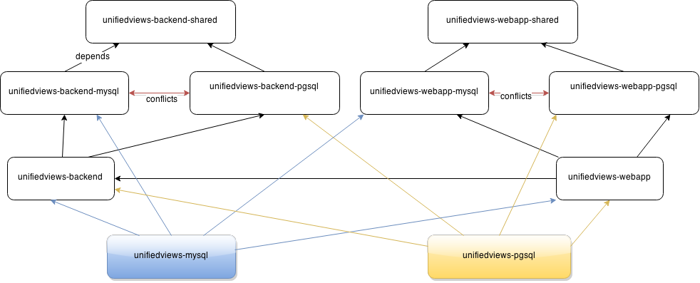

Packages
========

Please see [UnifiedViews installation guide](https://grips.semantic-web.at/display/UDDOC/Installation+Guide)

**Note: This repository is deprecated. Debian packages are maintained as part of UnifiedViews/Core+Plugins repository**

Provides source for creating UnifiedViews packages for various Linux distributions.

To install unifiedview using postgresql
~~~bash
apt-get install unifiedviews-pgsql
~~~

To install unifiedview using mysql
~~~bash
apt-get install unifiedviews-mysql
~~~

How to create .deb packages for Debian:

go to where pom.xml is placed and run
~~~bash
mvn package
~~~

that creates files .deb in target/

The known issues:
- be aware of the possible problem - https://github.com/UnifiedViews/Core/issues/258
- to add backup configuration before an update installation of packages
- to clean database schema during a purge phase 
- to change location from /etc/unifiedviews to /etc/default/unifiedviews

